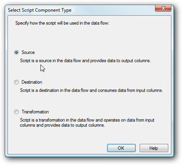
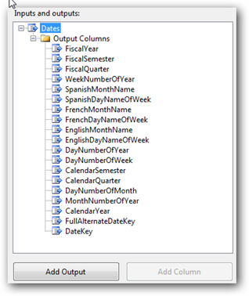
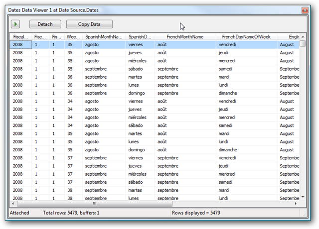

Every data warehouse needs a date dimension and at some point it needs to be populated. Most use some sort of a SQL script that loops though the dates and add rows to the destination table but this is pretty slow to execute. You might even try cross joining a year, month and day temporary tables to produce a set based solution but don’t forget to filter out the illegal days.

I prefer to fill my date tables by generating the correct stream of values from a SQL Server Integration Services script source component. This has a number of benefits:

- It executes very quickly
- The data can be bulk loaded
- CultureInfo supplies the correct translations of day and month names
- It is easy to add custom columns such as fiscal years and quarters

I haven’t wrapped this in a pre-compiled component as it is so easy to do in script from. Also, I haven’t got around to generalizing the fiscal date offsets for different companies so they usually have to be custom coded.

First drop a “Script Component” onto your Data Flow.

Select “Source” as the Script Component Type and click OK.

Then double-click the newly added component to edit the properties.

Note that you need to add the correct output columns before adding the script or else it won’t compile.

I’ve renamed the output here to “Dates” to help further down the Data Flow.

Click the “Add Column” button to add new columns as show here. Note that I’ve also changed the data type of each column to match my source table. It required casts in script but it’s easier than conversions in the data pipeline.

Finally go back to the script part of the dialog and click the “Edit Script” button to launch Visual Studio for Applications.

In the resulting window, add your code to generate the date stream to the CreateNewOutputRows() function.  
The general form is of:

var output = this.DatesBuffer;  // Get the output buffer

while (/\*loop though your dates\*?)
{

    output.AddRow();

    // Set the various column values e.g.
    output.CalendarYear = date.Year

    // Increment the date
    date = date.AddDays(1);
}

The full script is in the attached sample package where I’ve also added a script destination that does nothing with the data. Attach a data viewer to see what output is generated.

From here you can manipulate the data, and pipe it to your dimension table from within the pipeline.

[DateSourceSample.zip (27.08 KB)](http://sdrv.ms/1cAOfCU "Date Source Sample Code")
