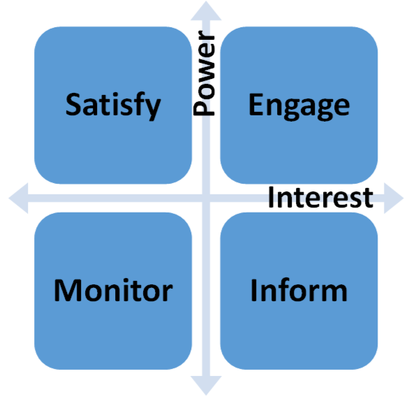

So its great that we know a little about [how mental health services work](http://snape.me/2013/03/09/mental-healthcare-workflow/ "Mental Healthcare Workflow") but as an architect we need to cover some more ground before the project can be considered up and running. This post is about the slightly dirty subject of stakeholders and politics.

Why do this? Well getting the politics right can mean the difference between a success and failure. All projects have stakeholders with specific concerns. Some can be ignored but in general it is the architect's job satisfy those concerns. Some stakeholders  have more power than others; they will also have varying levels of interest. The diagram below shows the best approach for each of the categories.

-  Low Interest - Low Power: the easiest category to deal with since they are not too concerned with the project and don't have the ability to derail you. Just monitor them for feedback  and other  information.
- High Interest - Low Power: this class of stakeholders want to know what is happening and still don't have the ability to disrupt the project. The best tactic is to ensure they are well informed.
- Low Interest - High Power: these stakeholders can be the most difficult to deal with since they have the power to influence not only your project but many of the other stakeholders. The main issue being that they are not that interested so it is difficult to have meaningful discussions and  negotiations. The primary tactic is to ensure their concerns are met with as little fuss as possible.
- High Interest - High Power: not only do they have the power to effect change but are interested in the outcomes. Personally I find this group a lot of fun since they can contribute to some very interactive sessions. The best tactic is to engage them which shouldn't be too difficult given their level of interest.

In the next post I'll cover classes of stakeholder and why it some of the non-obvious ones might be the most important.
