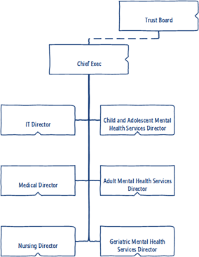

I want to briefly wrap up the section on stakeholders specific to mental health services because this is where we will get our requirements from.

At the top of the organisation is the chief executive and the trust board. Below her are the IT director, medical director, nursing director and three operational directors who are responsible for [Child and Adolescent Mental Health Services](http://en.wikipedia.org/wiki/Child_and_Adolescent_Mental_Health_Services "Child and Adolescent Mental Health Services") (CAMHS), Adult Mental Health Services and Geriatric Mental Health Services respectively.

The IT director is responsible for IT staff such as support staff and system administrators; IT systems and hardware; and IT projects.

The medical director manages all the doctors in the organisation and the nursing director similarly the nursing staff.

The operational directors focus on their individual services with a mix of staff including psychologists, counsellors, therapists, social workers and administration staff.

Collecting all the information we have so far with an estimate on the individual’s needs:

<table width="400" border="0" cellspacing="0" cellpadding="2"><tbody><tr><td valign="top" width="100"><strong>Who</strong></td><td valign="top" width="81"><strong>Interest/Power</strong></td><td valign="top" width="10"><strong>Class</strong></td><td valign="top" width="209"><strong>Concerns</strong></td></tr><tr><td valign="top" width="100">Chief Exec</td><td valign="top" width="81">Low/High</td><td valign="top" width="10">Acquirer</td><td valign="top" width="209">Low costs</td></tr><tr><td valign="top" width="100">IT Director</td><td valign="top" width="81">High/High</td><td valign="top" width="10">Acquirer/Assessor</td><td valign="top" width="209">Low costs Ease of deployment</td></tr><tr><td valign="top" width="100">Medical/Nursing Directors</td><td valign="top" width="81">Low/High</td><td valign="top" width="10">User</td><td valign="top" width="209">Minimal training, or time taken away from duties</td></tr><tr><td valign="top" width="100">Services Directors</td><td valign="top" width="81">Low/High</td><td valign="top" width="10">User/Communicator</td><td valign="top" width="209">Functionality</td></tr><tr><td valign="top" width="100">IT administrators</td><td valign="top" width="81">High/Low</td><td valign="top" width="10">Administrator</td><td valign="top" width="209">Automated maintenance Simple troubleshooting Secure implementation Zero friction installs and upgrades</td></tr><tr><td valign="top" width="100">User support staff</td><td valign="top" width="81">Low/Low</td><td valign="top" width="10">Support staff</td><td valign="top" width="209">Ease of use Training material</td></tr><tr><td valign="top" width="100">Team members</td><td valign="top" width="81">Depends/Low</td><td valign="top" width="10">Users</td><td valign="top" width="209">Functionality Ease of use</td></tr></tbody></table>

The last three are generalisations – if this were reality I would be looking for specific people since the Interest/Power level is unique to a person and not the role.
