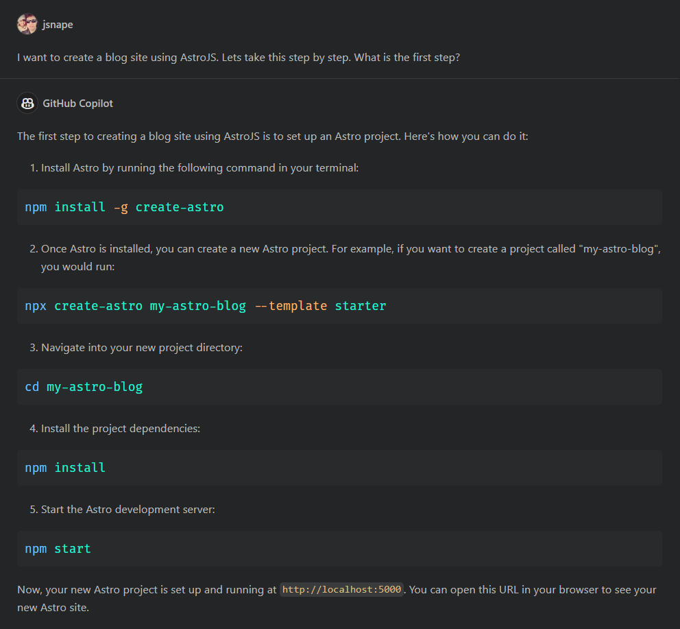

I have a little confession to make, this blog site hasn't entirely been written by me. I mean I did a lot of the typing but I've had a little help from Github CoPilot.

By trade I'm more on the backend side of things with C#, APIs and databases. I understand Typescript, HTML and CSS but its not natural for me to write. In the office I would find someone with complimentary skills to help out but this kind of personal project doesn't have that luxury.

GitHub CoPilot normally sits monitoring your code as you type offering completion suggestions which is do find a little annoying since they tend to pop up just as you are typing and then disappear. Maybe one day I'll get use to it in the same way I have [intellisense](https://learn.microsoft.com/en-us/visualstudio/ide/using-intellisense?view=vs-2022). Until then I far prefer the newer CoPilot Chat - its a tool window that sits next to your code and you chat to it like you would IM a colleague. The clever part is it can reference the code you are looking at.

Initially I just created an empty folder and run `git init` to initialize a blank repository. Lets kick off with a starter to get things going.

This doesn't look right; the [Astro Docs](https://docs.astro.build/en/getting-started/) say its far simpler to call `npm create astro@latest` instead. They may be equivalent but for now I'm going to trust the documentation. In fact I got pretty far with the docs and their [Build a Blog Tutorial](https://docs.astro.build/en/tutorial/0-introduction/). Whilst I was doing this I pretty much forgot about CoPilot Chat since the panel isn't always visible. I did get stuck later on though - trying to complete the archive list on the right I couldn't work out how to sort based on year and month. I figured it would be an idiomatic thing in JavaScript so asked:

Notice how the code I was looking at has been used as a reference. Here is another example when I was building the monthly archive:

I really like how the code comes with an explanation. This is teaching me as I work. The next challenge was to convert a month ordinal into a name for display. 

Now this is frustrating. It seems that since I get my CoPilot license through my work at Avanade, they have flipped a switch to ensure I don't [copy any public code](https://docs.github.com/en/copilot/configuring-github-copilot/configuring-github-copilot-settings-on-githubcom#enabling-or-disabling-duplication-detection) and open them up to legal issues. I can see the rationale but I'm just trying to learn here. I did wonder if the typo in the question had reduced the set of results coming back and that's why it thought I might be copying.

Correcting the typo did work.

This tool is super helpful when things aren't working too. For example, first time I viewed the archive list there were duplicates in the month names. Psychic debugging tells me that there is probably a duplicate for every individual post in that month because the `Set` class wasn't working as expected so I asked why.

Ah, in JavaScript, Dates are objects not values and compared by reference.

Similarly I had a warning about a possible null value. In C# I would use a null coalescing operator `??` with a default value. I want to know the JavaScript equivalent and could have asked but thought it best to just ask for the outcome I wanted.

For the last example I have, I had used CoPilot to help me build a simple search for that would submit the query by opening a new window on Bing with the search as a query parameter. I also appended `site:snape.me` to restrict the results back to this blog. Hard coded would have worked but I knew I already had the site name in the config and it would be better if loaded from there.

This is really useful because this isn't just about writing JavaScript, it tells me how to use the libraries I have included in the project. Alas it doesn't work though but not for long:

I used Co-Pilot to fix a lot of additional issues along the way but mostly boring TypeScript warnings so won't inflict those on you.

**So would I recommend this approach?** 

Absolutely, if you are a beginner or someone with skills in a different software area it can save a whole pile of time iterating whilst you find a solution. It will save you time looking up stuff on the web but just be aware that it might not always give you the best solution. It's a tool not a replacement but a lot less annoying than tapping your coworkers on the shoulder to ask dumb questions. Don't leave your brain at home though.

