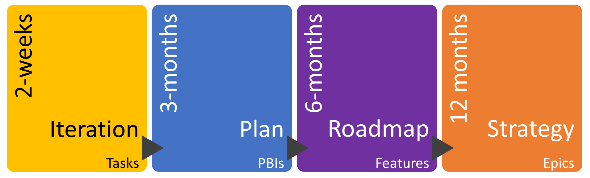

## Introduction

The [online documentation for iteration paths](https://learn.microsoft.com/en-us/azure/devops/organizations/settings/set-iteration-paths-sprints) has a graphic which could cost you some time in the future. Care to guess?

In case its not obvious, the sprint numbering starts from 1 again for each release. In my experience releases can move around but you really want sprints to be a consistent drum beat for the project.

## Sprints

This first question you need to answer is how long will a sprint be? You shouldn't be changing the length at all so picking a length can be tricky. The [scrum guide](https://scrumguides.org/scrum-guide.html#the-sprint) says this:

> Sprints are the heartbeat of Scrum, where ideas are turned into value.
>
> They are fixed length events of one month or less to create consistency. A new Sprint starts immediately after the conclusion of the previous Sprint.

A single week is less common but useful where you are not delivering software and have very short deadlines; though at this point maybe a simple kanban would be more efficient. The most common length is 2 weeks. [Microsoft DevDiv adopted a 3 week duration](https://learn.microsoft.com/en-us/devops/plan/adopting-agile). 4-weeks seems a little too long for me, long enough to be doing mini-waterfalls which is to be avoided.

I once heard somewhere is the length of a sprint should be as long as you can go and risk going in the wrong direction. Since feedback from customers only comes at the end of each sprint the opportunity for course correction is similarly timed.

Personally, if you are delivering software I would pick two weeks unless you can make a great case for three. This is especially true if you are new to agile - you really want that feedback regularly.

I would also recommend that you don't start/end sprints on Mondays or Fridays - these days are often when folks are not around for various reasons. Plus, who wants to spend all day in sprint meetings on a Friday.

You can now go and create a bunch of sprints in Azure DevOps. Create a nice long, but flat, list of sprints at the project level with start and end dates.

## Releases and other Milestones

Only after you have your sprint list should you apply any hierarchy to it. A sprint should deliver potentially shippable code but often not released. A release is a more formal affair. Scheduling with milestones can help with planning at epic or feature level for larger projects.

For large, long running product deliveries your planning will reach further out than your <abbr title="Product Backlog Item">PBI</abbr> backlog. At range, things get fuzzy so trying to plan in detail is a futile waste of effort. Remember that any work items specified but not delivered are considered inventory and incomplete work depreciates rapidly with knowledge and feedback gained along the way.

To help, I'm a fan of multiple levels as shown below ([also from Microsoft](https://learn.microsoft.com/en-us/devops/plan/how-microsoft-plans-devops)). At the top you have a strategic outlook for the next 12 months. These consist of epics only. Below that a roadmap of features you plan to deliver over the next six months. PBIs don't start to appear until the quarterly plan which is your main backlog. Finally tasks are created during sprint planning.

However you break this up you will have a hierarchy of iterations similar to the following:

- Vision-2024
  - Roadmap-2024-H1
    - Plan-2024-Q2
      - Sprint-1
      - Sprint-2
      - Sprint-3
      - Sprint-4
      - Sprint-5
      - Sprint-6
  - Roadmap-2024-H2
    - Plan-2024-Q3
      - Sprint-7
      - Sprint-8
      - Sprint-9
      - Sprint-10
      - Sprint-11
      - Sprint-12
    - Plan-2024-Q4
      - Sprint-13
      - Sprint-14
      - Sprint-15
      - Sprint-16
      - Sprint-17
      - Sprint-18
- Vision-2025
  - Roadmap-2025-H1
    - Plan-2025-Q1
      - Sprint-19
      - Sprint-20
      - Sprint-21
      - Sprint-22
      - Sprint-23
      - Sprint-24
    - Plan-2025-Q2
  - Roadmap-2025-H2
- Vision-2026

With a structure like this you can throw epics and features into a future planning bucket without worrying which iteration. This is a bit generic though; far better if you have catchy names for the vision, roadmap and plan levels since its easier to remember which one is current.

Sprints won't neatly fit into calendar boundaries like quarters, halves and years but its not a big deal. Just put an extra sprint somewhere or one less to keep them from drifting. Make sure the numbering is sequential still. Teams just work with sprints and its confusing if the sequence jumps.

Also, there are no releases on this list, just planning windows. Releases are orthogonal to iterations and move around a lot so the release a work item is completed in may not be the one originally intended. You can use build and release numbers for tracking this instead.

Since teams can use different iterations then unfortunately you need to select iterations at a team level too which just needs a lot of clicking. Go click one more time on [Team Configuration Option: Auto Populate Team Iterations with Project Iterations](https://developercommunity.visualstudio.com/t/Team-Configuration-Option:--Auto-Populat/10551547) if you would rather have them auto populated instead.

If you are going to be doing a lot of this then [scripting the creation of iterations](https://vinijmoura.medium.com/how-to-create-all-iterations-to-your-project-on-azure-devops-cedadb045705) is a way to save some time.

## Summary

Usually iterations don't get much thought at the start of a project and end up being rearranged as you need but they can be a useful way of planning deliveries at just the right level.

Photo by [Henry & Co.](https://unsplash.com/@hngstrm) on [Unsplash]("https://unsplash.com/photos/a-very-dark-room-1qlMnKfql5c)
  