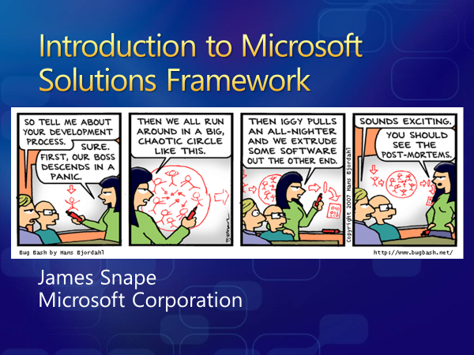
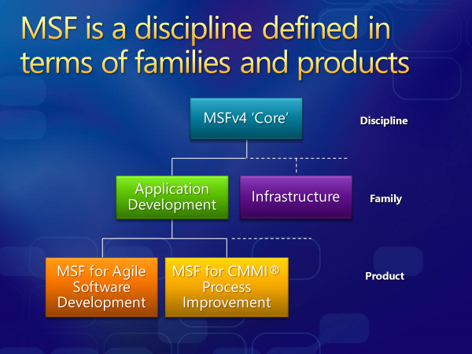

## Introduction

There are four process models supplied currently: Basic, Agile, Scrum, and CMMI. I'm not going to regurgitate the information already available online. Go and read for yourself the [main distinctions among the default processes](https://learn.microsoft.com/en-us/azure/devops/boards/work-items/guidance/choose-process?view=azure-devops&tabs=agile-process#main-distinctions-among-the-default-processes). Some differences might not be that obvious but will become apparent later.

## History

Azure DevOps has technically been around for quite some time. Before its current incarnation it used to be an on-premise version called Team Foundation Server (TFS). Before that I believe it existed as a Microsoft internal tool called Source Depot, but that might just have been the source control tool. TFS had two process templates - Agile and CMMI. Both of these were designed specifically for the Microsoft Solutions Framework process used by Microsoft Consulting Services, and others. It was part of my job at Microsoft to go and talk to customers about it as you can see from this very dated PowerPoint. Gotta love that gold gradient shadow text.

<aside class="italic">As an aside, the [Bug Bash comic](https://devblogs.microsoft.com/oldnewthing/20100618-00/?p=13663) was absolutely ruthless in its appraisal of software development but sadly its no longer available on the internet. We truly are going to have another dark ages.</aside>

The two flavours of this process were MSF for Agile Software Development and MSF For CMMI® Process Improvement.

So, the current Agile and CMMI process models have been around for a while. Both of them pre-date the first official Scrum guide release in 2010. They have been tweaked but not really modified to stay current. I can't imagine any team in Microsoft follows these processes any more.

## Making Your Selection

The history above is useful context but doesn't say why you shouldn't use these models apart from the fact they are old.

The CMMI process is really heavy with extra work item types and states used to manage a formal change management process. Work items have lots more fields that need to be filled out and steps from start to finish. It doesn't scream agile.

The Agile process, on the other hand, is a bit sly. It uses the right terms like User Story, Acceptance Criteria, and Story Points but a couple of things don't really marry with modern agile.

Firstly, the state transitions `New > Active > Resolved > Closed`. There isn't a state that really represents the backlog. You could use `New` but then you are mixing up work with the half baked ideas that may not make it onto the backlog. Also, the `Resolved` state implies there must be some form of verification before closure and that they must be done in order. Cross functional agile teams work together on committed work items until they are done. Sequencing work via a `Resolved` step means you are [queuing](https://snape.me/2024/03/batches-and-queues/).

Some fields can be unhelpful too specifically the `Completed Work` field which I wrote about a long time ago: https://snape.me/2014/09/06/tracking-hours-worked-on-a-scrum-task-is-counterproductive/. Interestingly, I've just checked my current Azure DevOps and this field has been removed from the Agile process so it is being improved.

To recap the above in a nice easy summary.

> Do not use the Agile or CMMI process models.

The two remaining models are Basic and Scrum. I love them both but they have very different purposes.

The Basic process model is reduced to a bare minimum. All work items are simply `Issues` with a higher level `Epic`. To differentiate different types of work you use tagging in the same way GitHub uses [labels on its issues](https://docs.github.com/en/issues/using-labels-and-milestones-to-track-work/managing-labels). Issue states are `To Do > Doing > Done` without extra process steps too.

The Scrum process model really looks like modern scrum with `Approved > Committed > Done` states to map onto product backlog, sprint backlog and done respectively. Additional approval states are removed to encourage in-sprint completion. Even the terminology of `Done` vs `Closed` maps better onto agile. Feature work items aren't defined in scrum but I find them useful as a unit of release deliverable vs product backlog item (PBI) as a unit of sprint deliverable (more on this in a future post).

My rule of thumb for choosing between these two process models is:

> If the process is for delivering software then pick Scrum otherwise pick Basic.

I use the Basic process model all the time for ad-hoc boards and task tracking for example: tracking architecture review board work, personal to do lists, support ticketing, governance structures etc. It is particularly useful for use with business users and other non-technical customers because most folks will understand the basics of a to do list whereas trying to describe the nuances between a task, a bug and a product backlog item can be tricky.

## Dealing With Process Jealousy

OK, so you picked Basic or Scrum but you quite like some of the things in other process models? That isn't too much of an issue since you can copy the definition of an interesting work item from the model it lives in to your model. There is an important point though:

> Always create an inherited process before selecting one for your projects.

You cannot change the standard processes so save yourself a minor inconvenience in the future by creating a model you can modify when you need to.

Examples of work item types I often add are:

- **Question** - used to document known unknowns typically associated with architecture or planning activities.
- **Decision** - for tracking decisions that need making and the outcome of those decisions.
- **Feedback** - used to formally track feedback from show and tell sessions. Often I prefer to just add new children (tasks or PBIs) to the existing work item than needs more effort.

## Finally

It's a trivial step at the point you create a project in Azure DevOps. Picking the right process model can help point you in the right direction. I'm  interested in how you chose the right process or what work item types would you add? Click one of the buttons below and tell me.

Photo by [Kaleidico](https://unsplash.com/@kaleidico) on [Unsplash](https://unsplash.com/photos/two-people-drawing-on-whiteboard-26MJGnCM0Wc)
