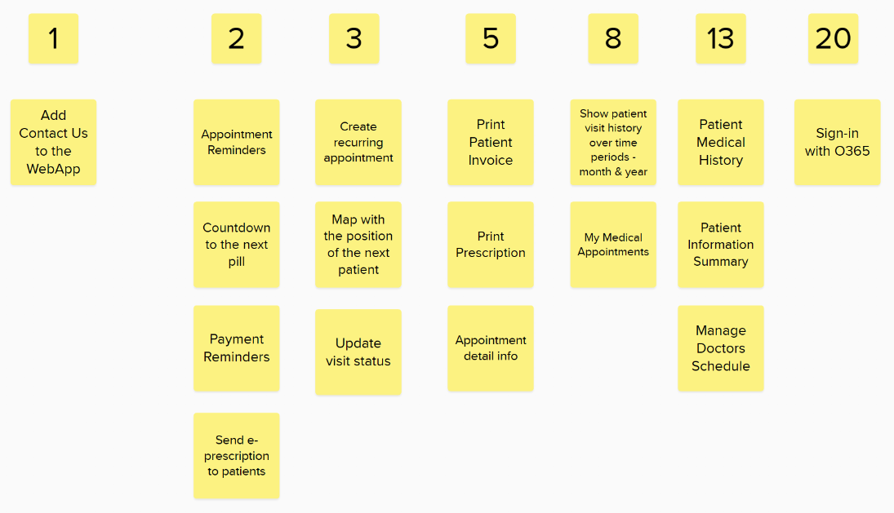

import Aside from '@components/Aside.astro';

## Introduction

The ability to estimate something is a core engineering skill. In software estimation is mostly about how long something will take to complete. I know lots of developers say they are terrible at estimation and will do anything to avoid giving a number. I think a lot of this has to do with our desire to be correct all the time but refusing to estimate isn't helpful; you just need to accept that sometimes your estimates may not be accurate.

## Relative vs Absolute Sizing

Humans in general are not great at working out the absolute size of something whether it be the length of a stick in meters or a task in hours. A good example of this is - quickly tell me how many characters are in the quote below?

> #############################

Its quite hard to tell quickly by not counting individual characters. I tried by halving the string and then again and again until I could easily count 4 then multiplied by the segments I divided. This was a quick estimate of 8x4=32. The actual string length is 29 so I'm out by 3, not too bad.

What humans are very very good at is estimating the relative size to something else. For example, is the second string longer, shorter or the same size as the previous one?

> ##############################

What about this one?

> ############################

Even though they are not right next to each other I'm sure you found it easy enough to guess they are longer and shorter respectively, even if its only by one character.

When it comes to story estimation, we find it much easier to estimate by comparing to another, similar story and this is where planning poker often fails.

## Planning Poker

I'm sure everyone knows how planning poker is supposed to work. Briefly its a little like this:

1. Product Owner gives an overview of the story to be estimated
2. The team ask questions to clarify assumptions and risks
3. Each team member picks a card to represent the estimate for the story (commonly fibonacci story points)
4. Everyone turns over their card
5. The highest and lowest card holders get an opportunity to justify their position
6. Repeat the card picking and justification until a consensus is formed

There is even a [pretty good extension for Azure DevOps](https://marketplace.visualstudio.com/items?itemName=ms-devlabs.estimate) to do all this remotely.

This should be a good way of estimating as it depends on the wisdom of crowds to come to a consensus. My issue is that by default this is an absolute estimation method. Even worse, its an absolute estimate of a non-specific measure - story points.

The part that is missing from most planning poker sessions is a menu of stories for comparison. This is especially true at the start of a project and the shear number of stories that need estimation create more temptation to take shortcuts.

<Aside type="caution">
I have seen some truly terrible versions of planning poker too - typically in these there is no hidden voting but instead after the story is described someone says "It feels like a 5, anyone think differently?"... everyone agrees and the story is now a 5 pointer. No wisdom of crowds here.
</Aside>

## An Alternative

My preferred method is to estimate all stories in one go by arranging them relative to each other. This is known as [Affinity Estimation](https://www.techagilist.com/agile/scrum/affinity-estimation-agile-estimation-method).

The first stage to to add a bunch of cards to a big board and then, one-by-one, align them based on their relative complexity. You have to be careful to take input from everyone and ensure decisions are not biased by others. The same level of justification takes place over positioning. At no point do you assign an absolute value.

If a story isn't ready or its not possible to estimate I colour the card red and move it away for later refinement and splitting.

You can put all the stories in a long line and just play higher or lower until the complete list is in relative size order but I find its easier to roughly group items and only place them in new columns when they are obviously bigger or smaller.

Once you have a rough grouping its time to make some decisions over the items not obviously in one column or another. 

Finally, check that each column represents stories that are approximately twice as big as the previous column. Only then can you assign your story point values.

This leaves you with a final block of estimations to paste back into Azure DevOps.

Don't throw this board away. When you come to estimate the next bunch of stories if you add them to this board you already have a ready made set of reference stories. As it grows bigger you might want to prune it and possible remove any that ended up not being representative of the effort assigned originally.

These reference stories can also be the basis for relative planning poker sessions in the future.

## Summary

Whilst I'm a fan of #NoEstimates and Lean methods which drastically reduce the important of estimating, we all have a responsibility for estimating our work. Planning Poker isn't the only game in town and its often abused so why not consider alternate ways of sizing your stories. Maybe try [White Elephant Sizing](https://www.techagilist.com/agile/scrum/white-elephant-sizing-agile-estimation/) once in a while too?

Photo by [Michał Parzuchowski](https://unsplash.com/@mparzuchowski) on [Unsplash](https://unsplash.com/photos/person-playing-poker-oT-XbATcoTQ)
  