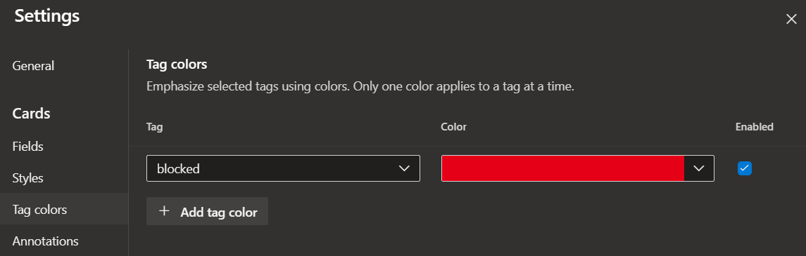
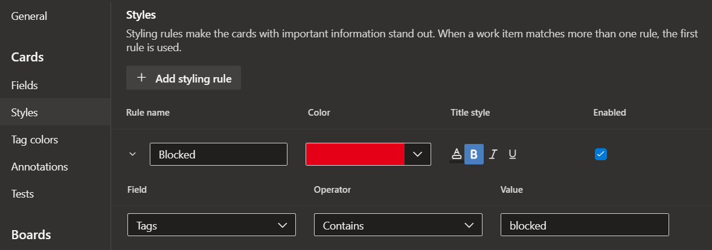
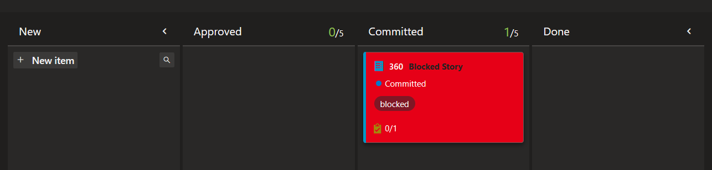
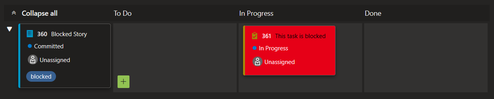

Whilst I was researching content for [Task, state, column or work item?](https://snape.me/2024/04/task-state-column-workitem/) I came across [Promoting "Blocked" to State from Status on Agile Board for better visibility](https://www.linkedin.com/pulse/promoting-blocked-state-from-status-agile-board-better-diva-jain/) which, IMHO, is absolutely the worst way to solve the problem of blocked work items. One of the comments even mentions creating a swimlane to put blocked items in which is especially bad since you can collapse the lane and forget about all your problems.

There are a number of reasons why a blocked column is a poor choice most of which discussed here:

- [Blocked is bad](https://www.linkedin.com/pulse/blocked-bad-brett-maytom/)
- [Don’t Make These 3 Scrum with Kanban Mistakes](https://www.linkedin.com/pulse/dont-make-3-scrum-kanban-mistakes-georgina-hughes-e5kdf/)

Using my [rules for states](https://snape.me/2024/04/task-state-column-workitem/#work-item-state) also implies that the only thing you can do to a blocked work item is to unblock it which isn't the case. 

A far better way to indicated blockage is with tags. Leave the work item where it is and add the `blocked` tag. Don't forget to add a comment as to why its blocked and, if possible, some tasks for getting it unblocked. The plain visual doesn't stand out much but you can apply some colour either as a tag colour: 
or card styling: 

which looks like  ... no missing that.

The same principle also works for tasks on on the taskboard but instead a field called `blocked` is used instead. 

Tags are so flexible you can use them in all sorts of ways. Some ideas for you:

- Forgo the initiative backlog level, its always got only one or two items in and never any useful description or acceptance critera. Instead just tag your work items.
- Use tags to differentiate different types of work item such as `story`, `question`, `decision` etc. This is more often used in the basic process.
- Use tags to call out things - `needs-discussion`, `ux-required`, `out-of-date`, `expired`, etc

Unfortunately, since tags have very little governance they can get a little out of hand. I use [Tags Manager](https://marketplace.visualstudio.com/items?itemName=YodLabs.TagsManager2) to merge misspellings and other issues.

Photo by [K. Mitch Hodge](https://unsplash.com/@kmitchhodge) on [Unsplash](https://unsplash.com/photos/graffiti-on-wall-during-daytime-vNmCItb-YPE)
  