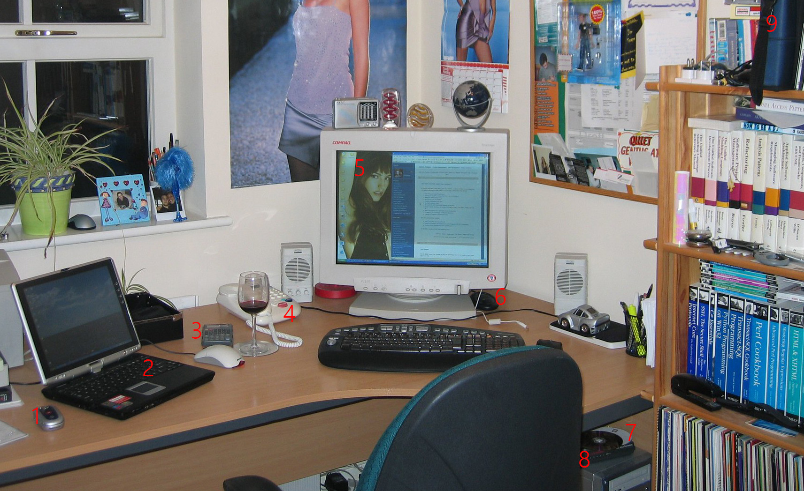

import Aside from '@components/Aside.astro';

I actually think this blog is older because I remember some really terrible and mundane posts that I decided to lose in the transfer to WordPress but since they were of such low value I'm happy they are gone. The [first post available](https://snape.me/2004/06/25/sprint-review-time) is from June 2004 so today I celebrate 20 years of blogging.

I started writing for a number of reasons but mainly as a self improvement goal. It was still early days of the internet, Dave Winer invented RSS in the late 90's and blogging as a concept started to become very popular from about 2002 onwards. The very first incarnation of this was hosted on Google Blogger which was frankly a pain to use and I was soon searching for something else.

I was regularly reading blogs of [Scott Hanselman](https://www.hanselman.com/blog), [Omar Shahine](https://www.omarknows.com/) and a few others who were using a blogging platform by [Clemens Vasters](https://vasters.com/clemens) called DasBlog so I set it up and started using it hosted on my own domain at `www.jamessnape.me.uk` (don't bother clicking - it doesn't exist anymore). It was a friendly little club - I even contributed a new theme for dasBlog called [Tricoleur](https://github.com/shanselman/dasblog/blob/036f9f29c2056124d4e976ede2c9d75e8c026ea2/source/newtelligence.DasBlog.Web/themes/Tricoleur/homeTemplate.blogtemplate#L95C1-L96C1).

> The computer monitor in the post image has my DasBlog site open in Internet Explorer before I moved it over to the theme I created.

The thing about blogging is that its perfect fodder for search engines; before Harry Potter came along I can safely say my little blog was the top hit for 'Snape'. I really wanted to work for Microsoft and undoubtedly this got me a call from a Microsoft recruiter in 2006. It didn't take much for me to accept their offer.

I continue to write articles that interest me whilst at Microsoft and you can see my progress towards specialization in [business intelligence](http://snape.me/category/business-intelligence) before I joined BNP Paribas. I found it harder to write since I couldn't talk about what I was doing at work so there is a gap between 2010 and 2013 but eventually I came back and migrated to https://jamessnape.wordpress.com/ on this snape.me domain because I didn't want to continue upgrading and managing a codebase I wasn't actively involved in.

Since I couldn't write about work I created a fictitious solution for [mental health](http://localhost:4321/tag/mental-health-project) with my wife, Claire, as the notional 'client'. It did end up feeling like I was working two jobs though.

WordPress.com is an excellent platform and I recommend it for non-technical folks but the code formatting capability is awful unless you spend $25 a month to install a plug-in that will do a better job (or host your own which is why I moved from DasBlog). I also missed the general tinkering that I could do with DasBlog. A move to Hitachi Consulting in 2015 left me with very little time to blog and also not being able to discuss work so there is another gap until this year and another WordPress renewal fee looming.

Technology moves on and Github Pages is a free option where I can tinker with the site what you see now. One of the benefits to using Astro is that I can maintain the URLs exactly as they were when hosted on WordPress.

I was careful with 301 redirects when moving from DasBlog to WordPress so this entire blog has been accessible from the same url paths since I started. A huge part of the internet disappears every day - its mostly corporate sites as bloggers tend to want to keep their content online. We are creating a digital dark ages for future generations. If you look back at any of my [interesting links posts](http://snape.me/category/reference) then the link rot is obvious.

The rise of walled gardens like Facebook and Linkedin mean that more and more content is hidden out of sight. Even medium is leaning hard into member only content. It's understandable as AI models are being trained on freely available content. I have excluded AI training bots in my robots.txt but I read that multiple [AI company crawlers are ignoring these conventions](https://www.reuters.com/technology/artificial-intelligence/multiple-ai-companies-bypassing-web-standard-scrape-publisher-sites-licensing-2024-06-21/) pushing more content out of sight.

I see this site as the classic car you have in a garage - something to work on at weekends, something that brings a sense of satisfaction and a slightly more creative outlet to my day job. I hope I am still blogging in another 20 years.

<Aside type="note" title="Header Image">
The header image from this post is my home office in October 2004. The posters on the walls are a little embarrassing and unfortunately [Sarah Harding sadly died recently](https://www.bbc.co.uk/news/entertainment-arts-58456170) but there are plenty of other interesting things:

1. Motorola flip phone; before we were glued to our iPhones.
2. Toshiba laptop that folder flat and had a stylus to use. I spent a serious chunk of cash on this but I expect an ipod has more computing power now.
3. Calculators aren't really needed anymore.
4. Desk phone...we barely have a landline anymore.
5. CRT monitor, these were heavy.
6. Wireless mouse and keyboard needed a dedicated receiver. Given the distance between them I'm not sure there was any benefit over wired.
7. Rewritable CD-ROMs because that is how we shipped software.
8. This is either a dial-up modem or a DSL modem. I can't remember when I got DSL at home but it was about 0.5Mb to start with.
9. My trusty stack of MSDN discs for the various operating systems, databases and other tools I used.

The wine is also much better quality now too.

</Aside>
