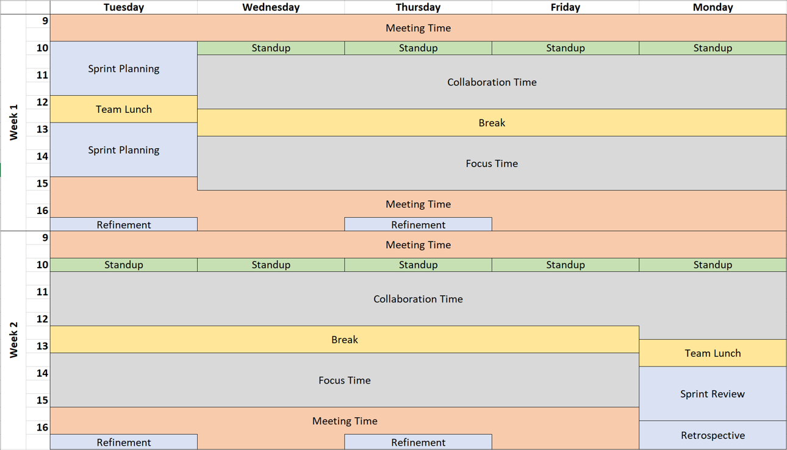
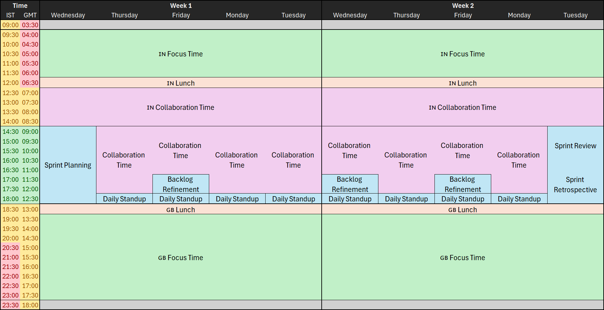

If you are not familiar with [Maker's Schedule vs. Manager's Schedule](https://www.paulgraham.com/makersschedule.html) take a few moments to read it first...This is the reason why you might not be getting much work done. The article provides a little advice on how to fix it but I want to be a bit more prescriptive.

Lets think about the kinds of activities we need in any given sprint:

- Scrum (or other agile process) ceremonies:
  - Sprint Planning
  - Daily Scrum / Standup 
  - Sprint Review
  - Sprint Retrospective
  - Backlog Refinement (not strictly a ceremony but still essential)
- Meeting with other team members towards the sprint goal: Collaborating
- Working alone: Focusing
- External meetings: Time Wasting 😉
- Lunch, breaks etc: Self-care

I like to use these categories to block out time according to function for the whole team. That way everyone is aligned and not trying to book meetings when other's are trying to focus. Rather than try explain I'll use an example from a previous project:

This is a 2-week sprint that starts on a Tuesday. Scrum ceremonies are in blue at the start and end of the calendar. I prefer to do refinement in smaller blocks so a few are spread throughout the calendar.

External meetings are pushed to the start and end of the day so as to not interrupt the maker's schedule. There is a lot of meeting time allocated here but the expectations are that its not fully booked.

Daily stand-ups happen at the start of collaboration time since this allows the short daily scrum to spill over into dedicated huddles if necessary.

Focus time is blocked out for everyone. Team members are encourages to turn on do-not-disturb and use the [automatic focus time](https://support.microsoft.com/en-us/topic/focus-with-viva-insights-41e6274d-a1ac-42a5-8e9e-ac432e0447c9) feature in Outlook.

This particular example was created to deal with some very distracting managers so I expect in a better environment the allocated meeting time can be reduced much more.

A second example more recently with the additional challenge that the team spans two timezones - GMT and IST. 

To tackle this I started by listing up the time-slots for each timezone to see where days overlapped. Green is fully overlapped; yellow means someone it staying late/starting early but not totally unreasonably; red is pretty antisocial and to be avoided.

Pretty obviously, the best times to meet and collaborate are during the green overlap so end of day India time and start of day in the UK. This is where all the ceremonies and collaboration times are located.

The daily standup unfortunately in the middle of the day for UK staff but since most of the development done in India they are prioritized at the end of their day as the makers.

Getting an agreement on this calendar across the whole team is worthwhile to avoid inadvertently destroying developer focus.

Tell me, what kind of calendar do you use? Click one of the buttons below now and let me know.

Photo by [Jason Goodman](https://unsplash.com/@jasongoodman_youxventures) on [Unsplash](https://unsplash.com/photos/man-standing-behind-flat-screen-computer-monitor-bzqU01v-G54)

