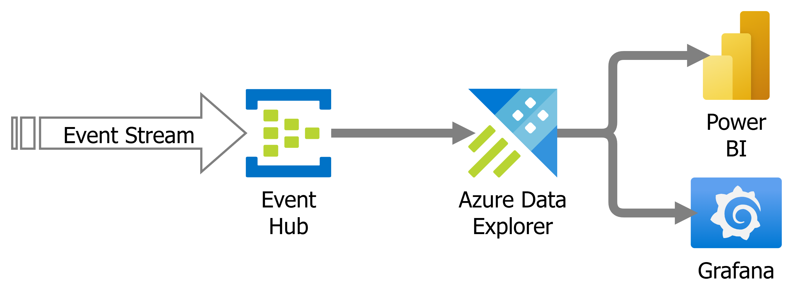

import Aside from '@components/Aside.astro';

## Introduction

Event-driven architectures are everywhere—IoT telemetry, application logs, click-streams, financial transactions. The common pattern? High-volume, high-velocity data streams flowing into your cloud environment.

Most teams instinctively think:

> We need to store this data. Let’s use Cosmos DB.

But here’s the problem: storage alone doesn’t deliver value. If you can’t analyze your events quickly, you’re operating in the dark. And bolting analytics onto a transactional database like Cosmos DB is a recipe for latency, complexity, and large cloud bills.

## The Analytics Gap

- Cosmos DB excels at storage and transactional queries, but struggles with:
    - Large-scale aggregations.
    - Time-series analysis.
    - Sub-second response times for dashboards.
- Adding analytics on top of Cosmos often means:
    - Exporting data to another system (extra cost and complexity).
    - Waiting minutes for queries that should take milliseconds.

## Why ADX makes all the difference

Azure Data Explorer (ADX) was designed for real-time analytics on event streams:

- Native ingestion from Event Hub and IoT Hub.
- Columnar storage and indexing for speed.
- Kusto Query Language (KQL) for powerful aggregations and anomaly detection.

Instead of storing events and then struggling to analyze them, ADX lets you:

- Ingest millions of events per second.
- Run queries instantly.
- Build dashboards that update in real-time.

## Architecture Snapshot

To recap from the last post, here’s what a modern event analytics pipeline should look like:



- Event Hub: Handles ingestion from devices or apps.
- ADX: Stores, indexes, and makes data query-ready.
- Power BI / Grafana: Visualizes insights for decision-making.

## Hands-On Example

To show how easy this is let's create a quick demo. To illustrate the point about ADX being used for more than logs the example will focus on an e-commerce website business events.

<Aside>
To save you some typing I've made the code available at https://github.com/jsnape/adx-demo with a more complete example.
</Aside>

Create an ADX cluster and EventHub in the Azure Portal. There is an ARM template and script to deploy a minimally sized set of resources to an Azure location of your choice in the GitHub example. Just execute:

```powershell
cd infrastructure
.\deploy-resources.ps1 -ResourceGroupName "rg-adx-demo" -Location "eastus"

```
Connect to your ADX cluster and, using the query editor execute the following command to create and configure an Orders table:

```kql
// Enable streaming ingestion
.alter database EcommerceAnalytics policy streamingingestion enable

// Create a basic Orders table
.create table Orders (
    OrderId: string,
    CustomerId: string,
    CustomerSegment: string,
    EventType: string,
    Timestamp: datetime,
    TotalAmount: real,
    Currency: string,
    PaymentMethod: string,
    ShippingCountry: string,
    ShippingState: string,
    ShippingCity: string,
    Source: string,
    Items: dynamic,
    Status: string
)

// Set retention policies (keep data for 90 days)
.alter table Orders policy retention 
    ```{
        "SoftDeletePeriod": "90.00:00:00",
        "Recoverability": "Disabled"
    }```

// Enable streaming ingestion for orders
.alter table Orders policy streamingingestion enable
```

Next create an ingestion mapping. This demo is going to sent messages to an event hub with the following structure:

```json
{
  "eventType": "order_placed",
  "timestamp": "2025-11-28T12:44:13.9236857Z",
  "orderId": "ORD-20251128-545569",
  "customerId": "CUST-9198",
  "customerSegment": "vip",
  "totalAmount": 369.95,
  "currency": "USD",
  "paymentMethod":"apple_pay",
  "shippingAddress":
  {
    "country": "FR",
    "state": "",
    "city": "San Diego"
  },
  "source": "mobile_app",
  "items":
  [
    {
      "productId": "PROD-003",
      "category": "automotive",
      "price": 49.99,
      "quantity": 2
    },
    {
      "productId": "PROD-005",
      "category": "books",
      "price": 89.99,
      "quantity": 3
    }
  ],
  "status":"confirmed"
}
```
For this example we will keep the mapping simple by importing the structure as it already is. Execute the following KQL in the ADX query editor.

```kql
// Orders ingestion mapping
.create table Orders ingestion json mapping "OrdersMapping"
'['
'    {"column":"OrderId","path":"$.orderId","datatype":"string"},'
'    {"column":"CustomerId","path":"$.customerId","datatype":"string"},'
'    {"column":"CustomerSegment","path":"$.customerSegment","datatype":"string"},'
'    {"column":"EventType","path":"$.eventType","datatype":"string"},'
'    {"column":"Timestamp","path":"$.timestamp","datatype":"datetime"},'
'    {"column":"TotalAmount","path":"$.totalAmount","datatype":"real"},'
'    {"column":"Currency","path":"$.currency","datatype":"string"},'
'    {"column":"PaymentMethod","path":"$.paymentMethod","datatype":"string"},'
'    {"column":"ShippingCountry","path":"$.shippingAddress.country","datatype":"string"},'
'    {"column":"ShippingState","path":"$.shippingAddress.state","datatype":"string"},'
'    {"column":"ShippingCity","path":"$.shippingAddress.city","datatype":"string"},'
'    {"column":"Source","path":"$.source","datatype":"string"},'
'    {"column":"Items","path":"$.items","datatype":"dynamic"},'
'    {"column":"Status","path":"$.status","datatype":"string"}'
']'
```

The last step involves binding the event hub where messages are being set to the streaming import in ADX.

```powershell
## Replace these values with your own.
$resourceGroupName = "YOUR-RESOURCE_GROUP_NAME"
$clusterName = "YOUR-ADX-CLUSTER_NAME"
$eventHubNamespace = "YOUR-EVENTHUB-NAMESPACE"
$databaseName = "YOUR-ADX-DATABASE_NAME"
$eventHubName = "YOUR-ADX-EVENTHUB_NAME"
$location = "eastus" # replace if you installed elsewhere

## Get Event Hub resource ID
$eventHubResourceId = "/subscriptions/$(az account show --query id -o tsv)/resourceGroups/$resourceGroupName/providers/Microsoft.EventHub/namespaces/$eventHubNamespace/eventhubs/$eventHubName"

## Create a consumer group first
az eventhubs eventhub consumer-group create `
    --resource-group $resourceGroupName `
    --namespace-name $eventHubNamespace `
    --eventhub-name $eventHubName `
    --name "orders-consumer"

## Create the connection to ADX orders table
az kusto data-connection event-hub create `
    --cluster-name $clusterName `
    --database-name $databaseName `
    --data-connection-name "orders-connection" `
    --resource-group $resourceGroupName `
    --location $location `
    --event-hub-resource-id $eventHubResourceId `
    --consumer-group "orders-consumer" `
    --table-name "Orders" `
    --data-format "JSON" `
    --mapping-rule-name "OrdersMapping"
```
The last three parameters are the important parts of this: import into table Orders, from JSON format using the OrdersMapping mapping.

ADX will now be waiting for messages to import. To help I've written a console app to post some generated content to the event hub.

```powershell
cd src\EventProducer
dotnet restore
dotnet build
dotnet run
```

<Aside type="tip">
If you ran the deploy-resources.ps1 setup script above it will have created an `appsettings.Development.json` file with the correct secrets in. If not you will need to find the correct values in the portal and update the values. The file should contain the following.

```json
{
  "Kusto": {
    "ClusterUri": "",
    "DatabaseName": ""
  },
  "EventHub": {
    "EventHubName": "",
    "ConnectionString": ""
  }
}
```
</Aside>

To check data is being imported run a simple KQL query:

```kql
Orders  
| summarize count() by bin(Timestamp, 1m)  
```

This gives you a real-time event count per minute—something that would be slow and expensive in Cosmos DB.

## Key Takeaways

- Storing events ≠ extracting insights.
- ADX is purpose-built for low-latency, event stream loading.
- It's simple to create ingestion pipelines into ADX.

### Next Post Preview

In Post 3, we’ll do a deep architecture comparison of ADX vs Cosmos DB and show why ADX wins for streaming analytics.

Photo by [Maël BALLAND](https://unsplash.com/@mael_balland) [Unsplash](https://unsplash.com/photos/people-sitting-on-green-grass-field-during-daytime-7rImz-goqfQ)

      